# OpenReadiness

[](https://github.com/imrajyavardhan12/openreadiness/actions/workflows/ci.yml)


[](LICENSE)

**An open-source, on-device readiness score and health data explorer for every Apple Watch, not just Series 12.**

| Today | Health | Steps | Sleep |
|---|---|---|---|
| 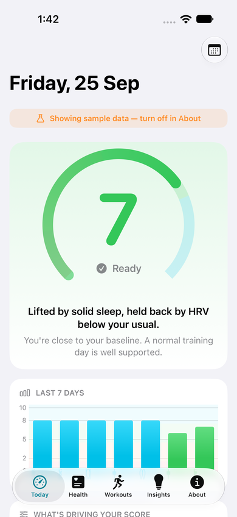 | 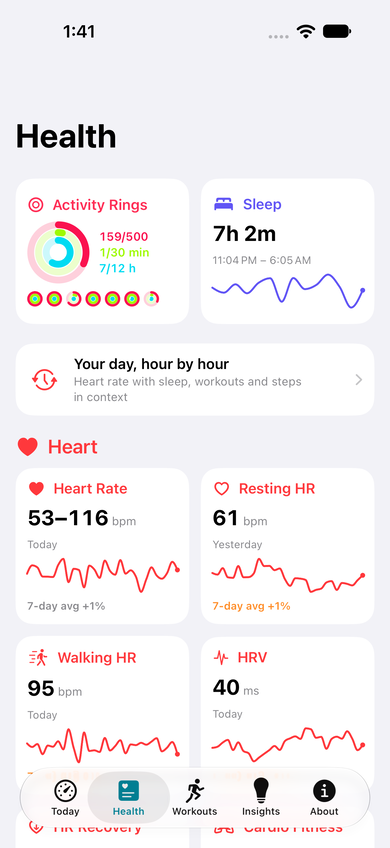 | 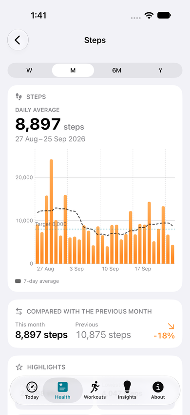 | 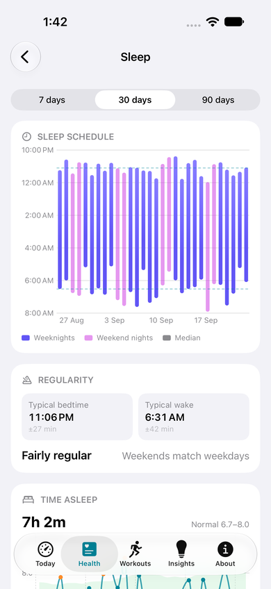 |

| Insights | Workout | Timeline | HRV |
|---|---|---|---|
| 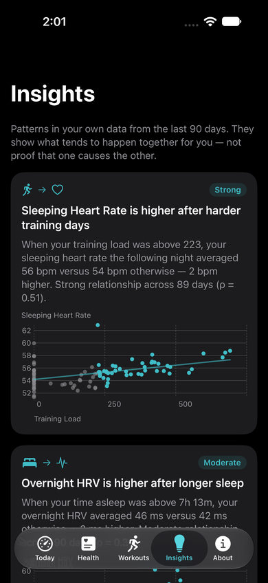 | 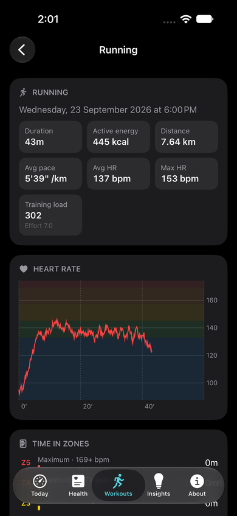 | 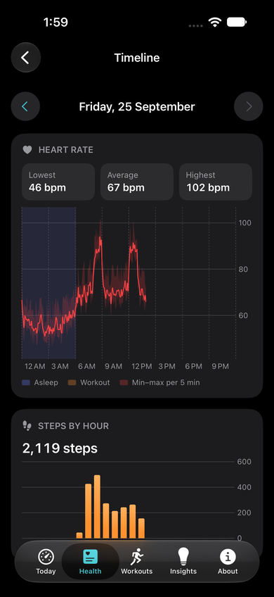 | 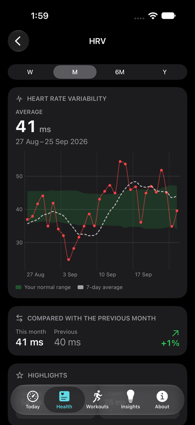 |

| Widgets | Lock Screen & watch face |
|---|---|
| 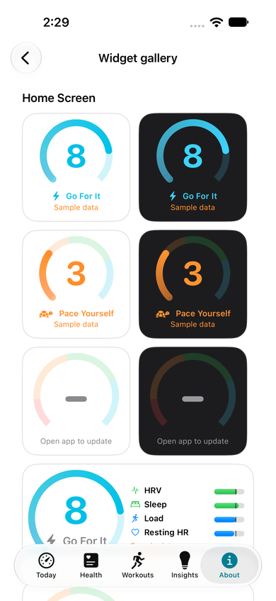 | 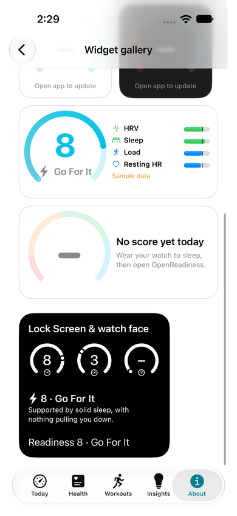 |

| Watch: score | Watch: HRV detail | Watch: last night | Watch: HRV trend |
|---|---|---|---|
| 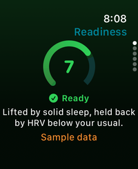 | 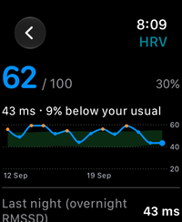 | 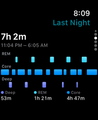 | 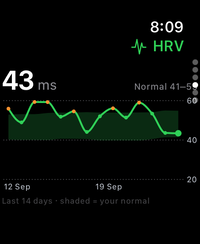 |

<sub>Screenshots use the built-in sample data. They are generated by the UI test suite (⌘U).</sub>

watchOS 27 introduced a 0–10 Readiness score, but only on Apple Watch Series 12 and Ultra 4.
OpenReadiness builds a comparable score from HealthKit data that older watches already record: HRV,
sleeping heart rate, sleep, training load and overnight vitals. It shows exactly how each point was
calculated, and every metric is charted against *your own* normal range.

- **Transparent.** Each contributor shows its inputs, your baseline, its z-score, its weight and
  how many points it added or removed. The full method is in [docs/ALGORITHM.md](docs/ALGORITHM.md).
- **Personal.** Everything is compared with your last 60 days, using outlier-resistant statistics.
- **Private.** It computes on-device and only reads from Health. It has no servers, accounts or analytics.
- **Better charts.** Trends show a shaded personal normal band, plus a sleep hypnogram, acute vs
  chronic training load, a calendar heatmap of scores, and tap-to-scrub values.
- **A full health explorer.** It covers 21 Apple Watch metrics and shows where Apple Health falls
  short (see below).
- **Familiar.** The bands are the same as Apple's: Recover 0–1 · Pace Yourself 2–4 · Ready 5–7 · Go For It 8–10.
- **On your wrist.** The watch app shows the score, what's driving it, last night's sleep stages,
  and 14-day HRV and resting-heart-rate trends against your normal range.
- **At a glance.** Home Screen and Lock Screen widgets and watch-face complications. HealthKit
  background delivery keeps them current overnight, even when the app is closed.

> Not a medical device. Not affiliated with Apple.

## Beyond Apple Health

| Apple Health | OpenReadiness |
|---|---|
| A chart with no sense of what's normal for you | A personal normal band and a 7-day average on every metric |
| One chart per metric | This period vs the last one, records and streaks, a day-of-week pattern, a distribution, and a 12-month heatmap |
| Heart rate as a cloud of dots | Daily min–max range bars, and a 24-hour timeline with sleep and workouts shaded in |
| Sleep one night at a time | A bedtime and wake chart, regularity, weekend drift ("social jetlag"), and stage trends |
| Workouts as a list | Weekly volume by activity, per-workout heart rate on zone bands, and time in zones |
| Metrics in isolation | **Insights**, automatic findings about what relates to what for you (e.g. "Overnight HRV is higher after longer sleep"), with ρ and sample size, plus a scatter-plot explorer |
| A rings history that's hard to browse | A month grid of rings with closure rates |

The explorer covers these metrics. **Heart:** heart rate, resting, walking, HRV, heart-rate
recovery, cardio fitness (VO₂ max). **Activity:** steps, active energy, exercise, stand, distance,
flights. **Respiratory and body:** respiratory rate, blood oxygen, wrist temperature. **Mobility:**
walking speed, step length, asymmetry. **Environment:** sound exposure, headphone audio, time in
daylight.

Reference lines are shown only where there's solid evidence, each with its source: 8,000 steps
(Paluch 2022), 30 exercise minutes (WHO), heart-rate recovery above 12 bpm (Cole, NEJM 1999),
80 dB for noise (WHO), and SpO₂ 95–100 %.

## How the score works (short version)


| Contributor | Weight | What it measures |
|---|---|---|
| Heart rate variability | 30 % | Overnight RMSSD from beat-to-beat data (SDNN fallback) vs. your 60-day normal (log scale), blended with 7-day trend |
| Sleep | 25 % | Sleep score (duration 50 · bedtime consistency 30 · interruptions 20) + sleep debt |
| Training load | 20 % | Last 7 days vs. prior 3 weeks (session-RPE: minutes × effort) |
| Resting heart rate | 15 % | Lowest 30-min average while asleep vs. your normal |
| Overnight vitals | 10 % | Respiratory rate, wrist temperature, SpO₂ outside your range |

Exactly your normal scores 70 per contributor, which works out to a 7 (*Ready*). Missing signals have
their weight shared among the rest. A very poor HRV, resting HR, sleep or vitals score caps the
total so illness isn't averaged away. See [docs/ALGORITHM.md](docs/ALGORITHM.md) for every constant
and its rationale.

## Requirements

| | Minimum |
|---|---|
| iPhone | iOS 17 |
| Apple Watch | watchOS 10 (Series 4 or later). Any watch that syncs HRV and sleep to Health works for the iPhone app |
| Build | Xcode 16+ (developed with Xcode 27), [XcodeGen](https://github.com/yonaskolb/XcodeGen) |

Signal availability depends on the watch. Wrist temperature needs Series 8 or later, and blood
oxygen needs Series 6 or later where the feature is offered. Effort ratings need watchOS 11. The
score adapts to whatever is available.

## Getting started

```bash
brew install xcodegen
xcodegen generate
open OpenReadiness.xcodeproj
```

1. Select your team under *Signing & Capabilities* for both targets (HealthKit requires signing).
2. Run on your iPhone. The watch app installs alongside it.
3. No watch or no data yet? Tap **Explore with sample data** or pass the `-demo` launch argument.
   The Simulator also works with sample data.

Engine and analytics tests (fast, no Simulator needed):

```bash
cd Packages/ReadinessKit && swift test
```

UI walkthroughs, which also generate screenshots of every screen: press **⌘U** in Xcode with the
*OpenReadiness* scheme (iPhone) or the *OpenReadinessWatch* scheme (watch). Both apps accept `-demo`
to run on sample data.

## Try it on your own data (no developer account needed)

**In the app (Simulator or device):** go to *About › Data source › Import Health export…* and choose
`export.xml`. Every screen then shows your real history, including the score, charts, insights and
workouts. In the Simulator you can also pass the path directly as a launch argument (debug builds
only):

```
-importHealthExport /Users/you/Downloads/apple_health_export/export.xml
```

The export is parsed once, kept as a single protected file on the device, and can be removed at any
time. Widgets and the watch keep showing live data, not the import.

**From the command line:** the Health app can export everything it stores (**Health → your profile picture → Export All Health
Data**). Unzip the export on your Mac and run:

```bash
cd Packages/ReadinessKit
swift run -c release openreadiness-cli ~/Downloads/apple_health_export/export.xml
```

It prints what the model found (nights of sleep, HRV readings, how many had beat-to-beat data for
RMSSD), a year of scores with their distribution, how often each contributor was available, and
the last two weeks. Useful options:

- `--explain 2026-09-18` shows the full working behind one day's score
- `--as-of 2026-07-14` scores up to an earlier date
- `--days 120` changes the scoring window
- `--csv scores.csv` writes every day to a CSV

Everything runs locally and nothing is uploaded. The export is streamed, so a multi-year file
takes seconds. Keep exports out of the repository; `.gitignore` already excludes them.

## Project structure

```
Packages/ReadinessKit/     Pure-Swift scoring engine (ReadinessCore), explorer analytics
                           (HealthInsights) + HealthKit adapters
App/iOS/                   iPhone app: Today, Health, Workouts, Insights, About
App/watchOS/               Watch app: score, contributors, week
App/Widgets/, WatchWidgets Home/Lock Screen widgets and watch-face complications
App/Shared*/               Store, watch sync, theme, gauge, snapshot (shared across targets)
docs/                      ALGORITHM · ARCHITECTURE · RESEARCH
```

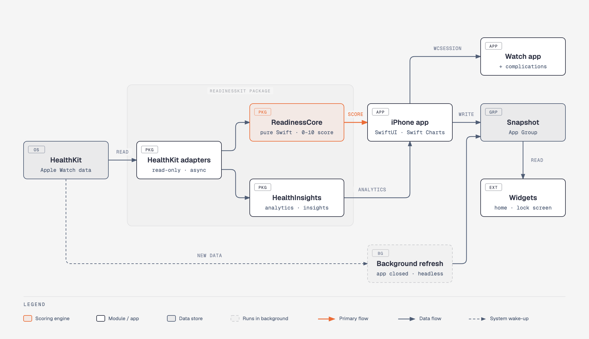

More detail is in [docs/ARCHITECTURE.md](docs/ARCHITECTURE.md). Background research on Apple,
Oura, Whoop and Garmin is in [docs/RESEARCH.md](docs/RESEARCH.md).

## Roadmap

- [x] Watch-face complications and Home/Lock Screen widgets (WidgetKit) with background refresh
- [x] RMSSD from beat-to-beat `HKHeartbeatSeriesSample` data (more sensitive than SDNN)
- [x] Watch app charts: contributor detail, last night's sleep, HRV and resting-HR trends
- [ ] Intraday updates (naps, daytime heart rate), as Apple does
- [ ] Menstrual-cycle-aware temperature and resting-HR baselines
- [ ] Localisation (String Catalogs are enabled)
- [ ] Optional subjective check-in (energy/soreness) to validate and tune the weights
- [x] CSV export of daily scores, contributors, inputs and all explorer metrics

## Privacy

See [PRIVACY.md](PRIVACY.md). In short, data never leaves your devices. The iPhone sends today's
score to your own watch using WatchConnectivity, and that is the only transfer.

## Contributing

Issues and pull requests are welcome, especially validation data, algorithm critiques with
references, and accessibility improvements. See [CONTRIBUTING.md](CONTRIBUTING.md).

## License

[MIT](LICENSE)
