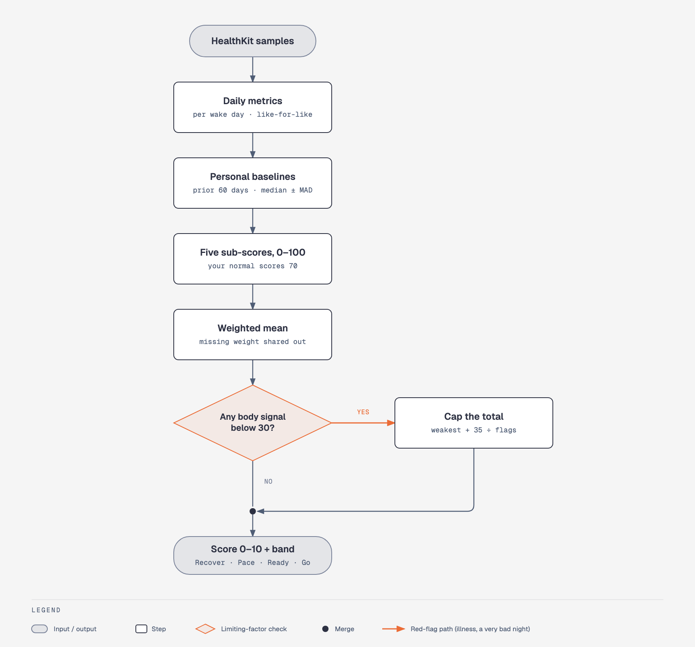

# The OpenReadiness algorithm

This document explains every step of the readiness score, the reasoning behind each constant, and
where it lives in code. All tunable numbers are in
[`ReadinessConfiguration.swift`](../Packages/ReadinessKit/Sources/ReadinessCore/Scoring/ReadinessConfiguration.swift).



> **Goal:** a score that is *transparent* (every point is attributable), *personal* (compared with
> your own history, not population norms) and *robust* (a single glitchy night can't swing it).

---

## 1. Inputs

Everything comes from HealthKit data that Apple Watch Series 4 and later already record (some
signals need newer hardware, noted below). The app never writes to Health.

| Signal | HealthKit type | Notes |
|---|---|---|
| Sleep & stages | `sleepAnalysis` | Stages on watchOS 9+; older data is "asleep (unspecified)" |
| HRV (SDNN) | `heartRateVariabilitySDNN` | Apple's HRV reading, taken several times a day and during sleep |
| HRV (RMSSD) | `HKHeartbeatSeriesSample` | Beat-to-beat timestamps behind each HRV reading; RMSSD computed here (§2.1) |
| Heart rate | `heartRate` | Read as 30-minute averages via a statistics query |
| Resting HR | `restingHeartRate` | Apple's daily estimate, used only as a fallback |
| Respiratory rate | `respiratoryRate` | Measured during sleep |
| Wrist temperature | `appleSleepingWristTemperature` | Series 8 / Ultra and later |
| Blood oxygen | `oxygenSaturation` | Series 6 and later, where available |
| Workouts | `HKWorkout` | Duration, avg HR, energy |
| Effort | `workoutEffortScore`, `estimatedWorkoutEffortScore` | watchOS 11+ / iOS 18+ |
| Active energy | `activeEnergyBurned` | Daily totals; load fallback when no workouts are logged |
| Age | `dateOfBirth` | For age-predicted max heart rate |

Apple's own **Sleep Score** and **Training Load** values are not exposed to third-party apps, so
equivalents are computed here from the underlying data.

## 2. From samples to days

A "day" is the calendar day you **woke up** on. For each day
([`DayMetricsBuilder`](../Packages/ReadinessKit/Sources/ReadinessCore/Analysis/DayMetricsBuilder.swift)):

- **Main sleep** ([`SleepAnalyzer`](../Packages/ReadinessKit/Sources/ReadinessCore/Analysis/SleepAnalyzer.swift)):
  sleep samples starting between 18:00 the previous evening and 15:00 on the wake day. Later
  sleep counts as a nap and is ignored. When several apps or devices recorded the night, the one
  source with the most sleep is used, and sources with stage data are preferred, so the night isn't
  double counted. Gaps of 3 minutes or more between asleep blocks count as interruptions.
- **Overnight HRV:** the geometric mean of the RMSSD values computed during the main sleep (§2.1),
  plus the same for Apple's SDNN readings. The *all-day* SDNN fallback uses readings from the
  previous day through 10:00 this morning.
- **Sleeping heart rate:** the lowest 30-minute average during sleep (needs at least 4 buckets).
  This is closer to what Oura and Whoop use than Apple's daytime resting-HR estimate. Apple's value
  is the fallback.
- **Vitals:** median respiratory rate and SpO₂ during sleep (±30 min), and the night's wrist temperature.
- **Training load:** see §4.4.

### 2.1 RMSSD from beat-to-beat data

Apple Watch only reports SDNN, but every HRV reading also stores the timestamp of each heartbeat
behind it (an `HKHeartbeatSeriesSample`, roughly one minute of beats). From those timestamps we
compute **RMSSD**, the root mean square of successive differences between beat-to-beat (RR)
intervals. It's the measure used in most HRV research and by Oura and Whoop. It mainly reflects
parasympathetic ("rest and digest") activity and is less affected than SDNN by slow drifts within
a short recording, which makes it the better recovery signal.

[`RMSSD.compute`](../Packages/ReadinessKit/Sources/ReadinessCore/Analysis/RMSSD.swift):

1. RR intervals come from consecutive beats. A beat flagged `precededByGap` (the watch lost
   contact) breaks the sequence instead of producing a false long interval.
2. Intervals outside 300–2000 ms (30–200 bpm) are rejected as implausible.
3. A successive difference is used only when both intervals are valid and differ by at most 20%.
   This is the standard rule for excluding ectopic beats and detection artifacts.
4. RMSSD = √(mean of squared successive differences). At least 20 clean differences are required,
   otherwise the reading is discarded.

Only series starting between 20:00 and 11:00 are read. The per-series results are cached on
device (see PRIVACY.md), because a recorded series never changes.

Overnight and all-day HRV (and sleeping vs. Apple resting HR) are kept separate. A day is always
compared with a baseline built from the *same* flavour, so one kind of reading is never scored
against another kind's baseline.

## 3. Personal baselines

For each signal, the baseline is the **previous 60 days** (the scored day is excluded):

- **Centre:** median
- **Spread:** 1.4826 × MAD (median absolute deviation). For normally distributed data this equals
  the standard deviation, but it is far less sensitive to outliers.
- **Minimum:** 7 values (Apple's Readiness uses "at least 7 of the past 49 nights"). Until then, the
  contributor is skipped and the score is marked *Calibrating*.
- **Spread floors** stop a very stable history from turning noise into big deviations:
  ln-HRV 0.08, heart rate 1.5 bpm, respiratory rate 0.5 br/min, temperature 0.15 °C, SpO₂ 0.5 %.

HRV is baselined on **ln(SDNN)**, because HRV is roughly log-normal and changes are multiplicative
(the standard approach in HRV-guided training research, e.g. Plews et al., 2013). This is why HRV
normal ranges look asymmetric in the charts.

## 4. Contributors → 0–100 sub-scores

A deviation is expressed as a z-score (how many "typical days" away from your median you are) and
mapped through a logistic curve:

```
subscore(z) = 100 / (1 + e^-(1.1·z + 0.847))
```

| z | −2 | −1 | 0 | +1 | +2 |
|---|---|---|---|---|---|
| subscore | 21 | 44 | **70** | 88 | 96 |

Scoring **70 at exactly your baseline** is deliberate: an ordinary day for you should land in
*Ready*, not in the middle of the scale.

### 4.1 HRV — weight 30 %
The first flavour that has both a value tonight and its own ≥ 7-night baseline is used, in this
order: **overnight RMSSD → overnight SDNN → last-24-h SDNN**. Flavours are never mixed within a
comparison.
`z = 0.7 · z(last night) + 0.3 · z(7-day geometric mean)` on the ln scale. Blending in the week
follows Oura's "HRV balance" idea and damps single-night noise. Higher is better.

### 4.2 Resting heart rate — weight 15 %
`z = −(value − median) / spread`: lower than usual is better. Elevated sleeping HR is one of the
most reliable early markers of illness, heat stress, alcohol or accumulated fatigue.

### 4.3 Sleep — weight 25 %
A nightly **sleep score (0–100)** that mirrors the published structure of Apple's watchOS 26
Sleep Score ([`SleepScorer`](../Packages/ReadinessKit/Sources/ReadinessCore/Scoring/SleepScorer.swift)):

| Component | Max | Rule |
|---|---|---|
| Duration | 50 | 0 at ≤ 3 h, linear to full at your sleep goal (default 8 h) |
| Bedtime consistency | 30 | Midpoint within 30 min of your 14-night median → 30, linear to 0 at 3 h. Neutral 20 until 3 nights exist |
| Interruptions | 20 | Full at ≤ 10 min awake, 0 at 60 min; −2 per wake-up beyond 2 |

Sleep stages are shown but **not scored**, because wrist-based staging is the least reliable part of
sleep tracking.

**Sleep debt:** average nightly shortfall vs. the goal over the last 7 tracked nights. 0 h → 100,
2.5 h → 20. Untracked nights are skipped, not counted as zero sleep.

`composite = 0.75 · sleep score + 0.25 · debt score`, then re-centred so a typical good night
(composite ≈ 85) lands at 75, like the other contributors' "normal" level:
`sleep subscore = clamp(75 + 1.33 · (composite − 85), 0, 100)`. Without this step, ordinary nights
would score in the 80s and push most days into *Go For It*.

### 4.4 Training load — weight 20 %
**Session RPE** (Foster et al., 2001): `load = minutes × effort (1–10)`. Effort comes from the
best available source
([`WorkoutLoadModel`](../Packages/ReadinessKit/Sources/ReadinessCore/Analysis/WorkoutLoadModel.swift)):

1. Your own effort rating (watchOS 11+)
2. Apple's estimated effort (watchOS 11+)
3. Heart-rate reserve: `10 × (avgHR − restHR) / (maxHR − restHR)`, with max HR = 208 − 0.7 × age
   (Tanaka et al., 2001)
4. kcal per minute ÷ 1.2
5. Assumed moderate effort of 4

**Acute:chronic ratio:** mean daily load over the last 7 days (today included) ÷ mean daily load over
the **21 days before that**. This is the *uncoupled* ratio, which avoids the mathematical coupling
criticised by Lolli et al. (2019). Apple's Training Load similarly compares 7 days with 28.

| Ratio | Label | Sub-score |
|---|---|---|
| < 0.8 | Fresh | 80 |
| 0.8 – 1.3 | Balanced | 78 → 68 |
| 1.3 – 1.5 | High | 68 → 45 |
| 1.5 – 2.0 | Very high | 45 → 25 |
| > 2.0 | Very high | 20 |

Yesterday's load relative to a typical day adds a short-term term (≤ 1× typical → 78, 2× → 55,
3.5× → 25):
`load subscore = 0.7 · ratio score + 0.3 · yesterday score`.

With no workouts logged in 4 weeks, daily **active energy** is used as the load signal. At least
14 days of history are required.

> The ACWR is a population-level injury-risk heuristic with real limitations (Impellizzeri et al.,
> 2020). Here it is a modest, clearly labelled input, and it is never allowed to cap the score (§5).

### 4.5 Overnight vitals — weight 10 %
Each available vital gets its own sub-score. A vital within its normal range scores 75 (normal, not a
bonus), then falls off:

- **Respiratory rate:** |z| ≤ 1 → 75, falling to 20 at |z| = 3 (low readings count half)
- **Wrist temperature:** deviation ≤ 0.3 °C → 75, falling to 25 at +1.0 °C (below normal counts half)
- **SpO₂:** drop ≤ 1 point → 75, falling to 20 at a 5-point drop

The contributor takes the **worst** vital. If two or more are out of range together, it loses a
further 10 points, because coinciding deviations are a much stronger illness signal than one alone.

### 4.6 Calibration check
Behavioural contributors (sleep, load) and vitals don't have a z-score, so their "ordinary day"
values are set to match the physiological ones (≈ 70–78). A unit test asserts that the median
score over months of realistic demo data is **7**, which guards against drift towards 8s.

## 5. Combining

1. **Weighted mean** of the available contributors, with weights renormalised over what has data.
   If less than 40 % of the model has data, no score is shown.
2. **Limiting factors.** If HRV, resting HR, sleep or vitals scores below 30, the overall score is
   capped at `weakest + 35 / (number of such contributors)`. One red flag caps at about its own
   level + 35. Three at once (the classic illness pattern of low HRV, high HR and abnormal vitals)
   cap at about the weakest + 12. Training load is excluded: a load spike is a caution, not evidence
   that your body is struggling right now. Garmin and Whoop use a similar "don't average away the
   red flag" rule.
3. **Round:** `score = round(raw / 10)`, clamped to 0–10.
4. **Bands** (identical to Apple's Readiness): Recover 0–1 · Pace Yourself 2–4 · Ready 5–7 · Go For It 8–10.

**Confidence** = (share of model weight with data) × baseline maturity, where maturity goes from
0.5 with no history to 1.0 at 28 nights.

## 6. Every score is reproducible

The engine is a pure function of `(RawHealthData, configuration, calendar, now)`. Historical scores
only look *backwards*, so a score for any past day is exactly what you would have seen that morning.
This is covered by unit tests (`swift test` in `Packages/ReadinessKit`).

## 7. Known limitations

- **Short recordings.** Each Apple Watch HRV reading covers about a minute of beats, and older
  watches take only a few per night. RMSSD from short windows is still noisy, which geometric
  means, log-scaling and the 7-day blend mitigate. Whoop and Oura, by contrast, sample
  continuously during deep sleep.
- **Reading frequency.** Older watches take HRV readings only a few times a night, and more
  readings improve accuracy. Series 12's Health Sensing System samples far more often, which is
  one reason Apple limits Readiness to it.
- **No menstrual-cycle adjustment** yet for temperature and RHR changes across the cycle.
- **Weights are expert-chosen, not fitted.** They are a reasonable prior. Community validation
  against subjective wellness data would be the ideal way to tune them.

## References

- Foster C. et al. (2001). *A new approach to monitoring exercise training.* J Strength Cond Res.
- Tanaka H., Monahan K., Seals D. (2001). *Age-predicted maximal heart rate revisited.* JACC.
- Plews D. et al. (2013). *Training adaptation and heart rate variability in elite endurance athletes.* Sports Med.
- Lolli L. et al. (2019). *Mathematical coupling causes spurious correlation within the conventional acute-to-chronic workload ratio.* Br J Sports Med.
- Impellizzeri F. et al. (2020). *Acute:chronic workload ratio: conceptual issues and fundamental pitfalls.* Int J Sports Physiol Perform.
- Apple Support: *Use the Readiness app on Apple Watch*; *Track your training load*; HealthKit documentation.
- Oura: *Readiness contributors*; Garmin: *Training Readiness*; Whoop: *Recovery*.
